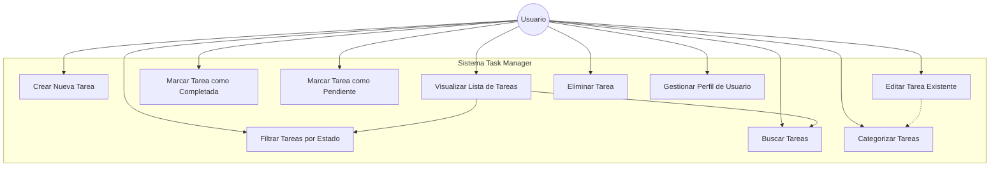
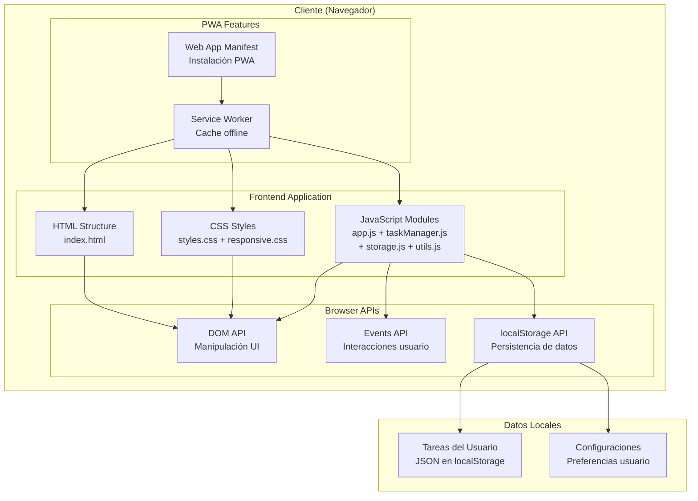
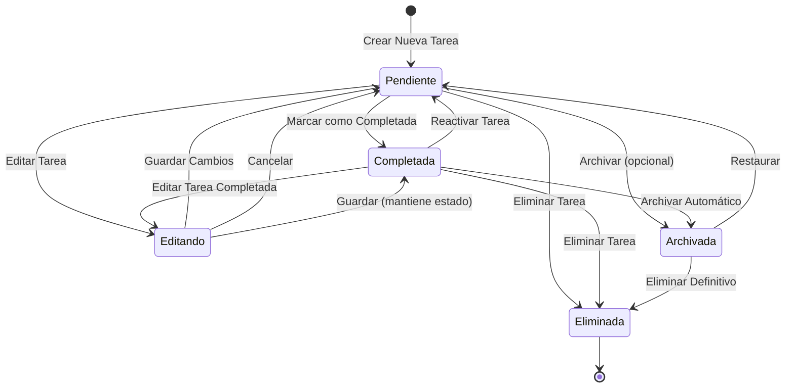
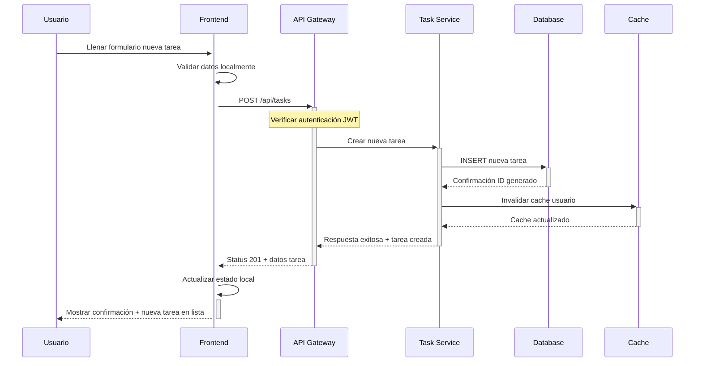
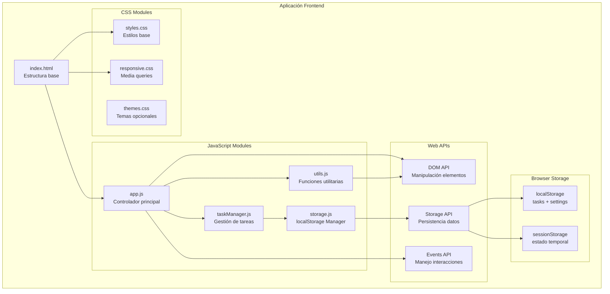
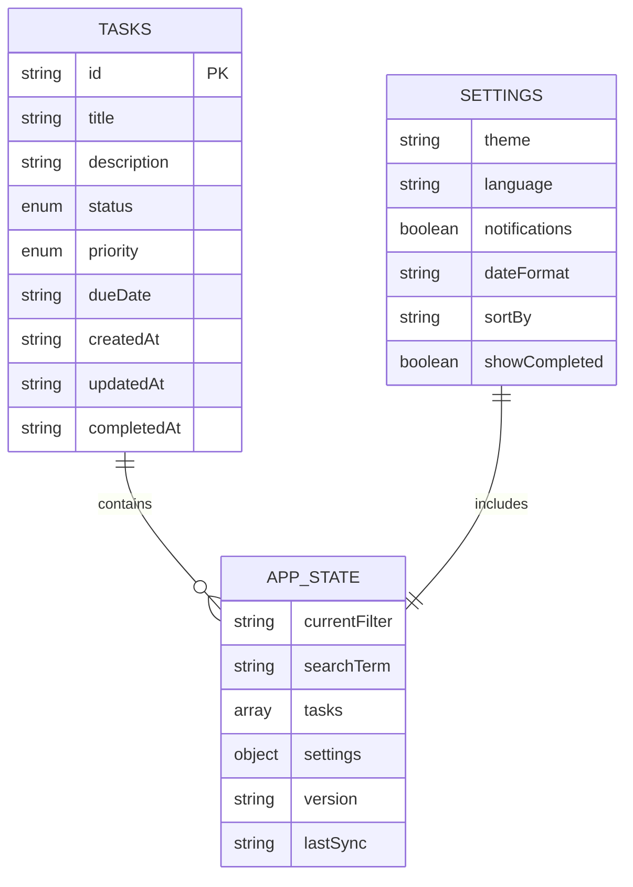
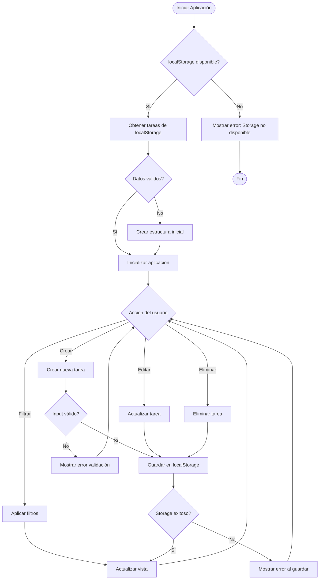

# Diagramas del Sistema
**Task Manager - Aplicación de Gestión de Tareas**

---

## 1. Diagrama de Casos de Uso



---

## 2. Diagrama de Clases del Dominio

```mermaid
classDiagram
    class User {
        -userId: string
        -email: string
        -name: string
        -createdAt: Date
        -preferences: UserPreferences
        +login()
        +logout()
        +updateProfile()
        +getPreferences()
    }
    
    class Task {
        -taskId: string
        -title: string
        -description: string
        -status: TaskStatus
        -priority: Priority
        -dueDate: Date
        -createdAt: Date
        -updatedAt: Date
        -completedAt: Date
        +create()
        +update()
        +delete()
        +markAsCompleted()
        +markAsPending()
        +addCategory()
    }
    
    class Category {
        -categoryId: string
        -name: string
        -color: string
        -createdAt: Date
        +create()
        +update()
        +delete()
    }
    
    class TaskCategory {
        -taskId: string
        -categoryId: string
        -assignedAt: Date
    }
    
    class UserPreferences {
        -theme: string
        -language: string
        -notifications: boolean
        -dateFormat: string
    }
    
    class TaskStatus {
        <<enumeration>>
        PENDING
        COMPLETED
        ARCHIVED
    }
    
    class Priority {
        <<enumeration>>
        HIGH
        MEDIUM
        LOW
    }
    
    User ||--o{ Task : owns
    User ||--|| UserPreferences : has
    Task }o--o{ Category : categorized
    Task ||--o{ TaskCategory : through
    Category ||--o{ TaskCategory : through
    Task ||--|| TaskStatus : has
    Task ||--|| Priority : has
```

---

## 3. Diagrama de Arquitectura de Sistema Frontend-Only



---

## 4. Diagrama de Flujo - Gestión de Estados de Tarea



---

## 5. Diagrama de Secuencia - Crear Nueva Tarea



---

## 6. Diagrama de Componentes Frontend



---

## 7. Modelo de Datos LocalStorage



## 8. Diagrama de Flujo - Operaciones con LocalStorage



---

*Documento versión 1.0 - Septiembre 2025*
